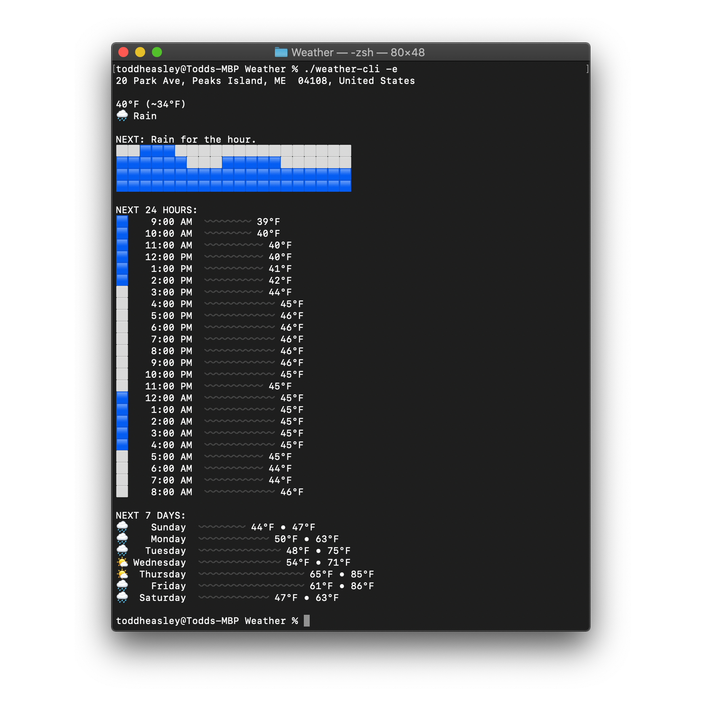

# `Weather`

`Weather` implements the complete [Dark Sky API](https://darksky.net/dev) for [Swift Package Manager.](https://github.com/apple/swift-package-manager)  It's fast and modular, leveraging `Codable` for serialization and `URLSession` for transport. Errors are concise and enumerated -- no mysteries or surprises. It works with Core Location out of the box.

It's the easiest way to add local (and localized) weather forecasts to any app on every Apple platform.

[](https://darksky.net/poweredby)

## Command-Line Interface

Included in the package



## Requirements

Targets [iOS](https://developer.apple.com/ios)/[iPadOS](https://developer.apple.com/ipad)/[tvOS ](https://developer.apple.com/tvos) 13, as well as [watchOS](https://developer.apple.com/watchos) 6 and [macOS](https://developer.apple.com/macos) 10.15 Catalina. Written in [Swift](https://developer.apple.com/documentation/swift) 5.2 using the [Foundation](https://developer.apple.com/documentation/foundation) and [Core Location](https://developer.apple.com/documentation/corelocation) frameworks and requires [Xcode](https://developer.apple.com/xcode) 11.4 or newer to build. Command-line interface depends on [Swift Argument Parser.](https://github.com/apple/swift-argument-parser)

## Example Usage

### API Key

`Weather` requires a (free) [Dark Sky API key](https://darksky.net/dev)* to function. `Forecast.Request` holds the API key as a static property that can be set once during app launch, and doesn't need to be configured with each request:

```swift
import Foundation
import Weather

Forecast.Request.key = "268a49e46c1b588ede555c8b4cc034f4"
```

_*Sadly Dark Sky is no longer accepting new signups, though the API is still available if you already have an API key. For now anyway. ☹️_

### Language

Forecasts are available in 50+ languages and growing. Check the [API documentation](https://darksky.net/dev/docs) for a complete, up-to-date list of supported languages.

By default, `Weather` requests forecasts in the current system language, defaulting to English if no matching translation is available. To request forecasts in a specific language, not the current system language, set a specific language code:

```swift
import Foundation
import Weather

Forecast.Request.language = .auto // Locale.current.language ?? .en
Forecast.Request.language = .auto(default: .es) // Locale.current.language ?? .es
Forecast.Request.language = .es // .es
```

### Measurement Units

Same deal with selecting a units system for measurements; set it and forget it:

```swift
import Foundation
import Weather

Forecast.Request.units = .auto // .us
```
All measurements with an associated unit (temperature, speed, distance, pressure) are deserialized to convertible [`Measurement`](https://developer.apple.com/documentation/foundation/measurement)  structs.

### Forecasts

Forecast requests require a geographic location to construct a specific request instance. Optionally, use the `Forecast.Block` enumeration to customize which sections ("blocks") are included in returned forecasts. (All blocks are included by default.)

```swift
import Foundation
import CoreLocation
import Weather

let coordinate: CLLocationCoordinate2D = CLLocationCoordinate2D(latitude: 43.6616968, longitude: -70.1937586)

Forecast.request(Forecast.Request(coordinate: coordinate, blocks: [.current, .alerts])) { forecast, error in
    guard let forecast: Forecast = forecast,
        let temperature: Temperature = forecast.current?.temperature else {
        print(error ?? .forecastNotAvailable)
        return
    }
    let formatter: MeasurementFormatter = MeasurementFormatter()
    formatter.unitOptions = .providedUnit
    print(formatter.string(from: temperature.actual))
}
```

### Time Machine

Any forecast request becomes a [time machine request](https://darksky.net/dev/docs#time-machine-request) by specifying a `Date` when constructing the request:

```swift
import Foundation
import CoreLocation
import Weather

let coordinate: CLLocationCoordinate2D = CLLocationCoordinate2D(latitude: 43.6616968, longitude: -70.1937586)

Forecast.request(Forecast.Request(coordinate: coordinate, date: Date(timeIntervalSince1970: 247156860.0))) { forecast, error in
    ...
}
```
